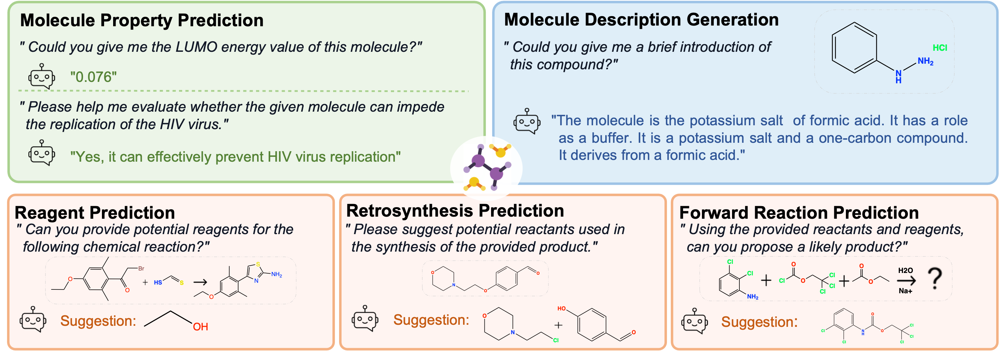
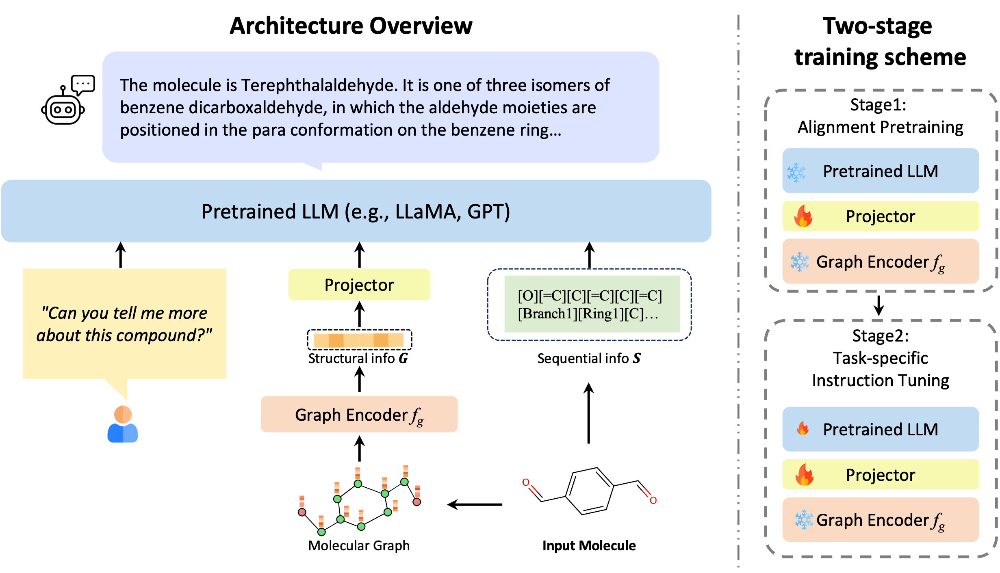

# InstructMol: Multi-Modal Integration for Building a Versatile and Reliable Molecular Assistant in Drug Discovery
Codes for our paper

<!-- *Visual instruction tuning towards large language and vision models with GPT-4 level capabilities.*-->

<!--[[Project Page](https://llava-vl.github.io/)] [[Paper](https://arxiv.org/abs/2304.08485)] [[Demo](https://llava.hliu.cc/)]  [[Data](https://github.com/haotian-liu/LLaVA/blob/main/docs/Data.md)] [[Model Zoo](https://github.com/haotian-liu/LLaVA/blob/main/docs/MODEL_ZOO.md)] -->

## Overview
<p align="center">
    <a>  </a>
</p>
The rapid evolution of artificial intelligence in drug discovery encounters challenges with generalization and extensive training, yet Large Language Models (LLMs) offer promise in reshaping interactions with complex molecular data. Our novel contribution, InstructMol, a multi-modal LLM, effectively aligns molecular structures with natural language via an instruction-tuning approach, utilizing a two-stage training strategy that adeptly combines limited domain-specific data with molecular and textual information. InstructMol showcases substantial performance improvements in drug discovery-related molecular tasks, surpassing leading LLMs and significantly reducing the gap with specialized models, thereby establishing a robust foundation for a versatile and dependable drug discovery assistant.

## Architecture
The diagram presented below provides an overview of the architectural design of the InstructMol model, along with its two-stage training paradigm. The example molecule in the figure is Terephthalaldehyde (CID 12173).
<p align="center">
    <a>  </a>
</p>

## Release
- [2023/11/27] 🔥 We first release our code (including training and evaluation scripts).


[](https://github.com/tatsu-lab/stanford_alpaca/blob/main/LICENSE)
[](https://github.com/tatsu-lab/stanford_alpaca/blob/main/DATA_LICENSE)
**Usage and License Notices**: The data, code and checkpoint is intended and licensed for research use only. They are also restricted to uses that follow the license agreement of LLaMA, Vicuna, LLaVA, Mol-Instructions and GPT-4. The dataset is CC BY NC 4.0 (allowing only non-commercial use) and models trained using the dataset should not be used outside of research purposes.


## Contents
- [Install](#install)
- [Weights](#weights)
- [Dataset](#dataset)
- [CLI Inference](#cli-inference)
- [Train](#train)
- [Evaluation](#evaluation)

## Install
Mostly refer to LLaVA installation
1. Clone this repository and navigate to project folder

2. Install Package
- If you have any trouble install torch-geometric related packages, please refer to [guide-to-pyg-install](https://github.com/chao1224/GraphMVP#environments) for detailed instructions.
```Shell
conda create -n instructmol python=3.10 -y
conda activate instructmol
pip install --upgrade pip  # enable PEP 660 support
pip install -e .

# Install Graph related packages. We use torch-112 with CUDA-11.6, please change accordingly.
pip install -r requirements.txt
```

3. Install additional packages for training cases
```
pip install ninja
pip install flash-attn --no-build-isolation
```


## Weights

### Component Weights Download
Create a folder named `checkpoints` in the root directory of this project. 
```Shell
mkdir checkpoints
cd checkpoints
```
Download the following weights and put them in the `checkpoints` folder.
```Shell
# Under the checkpoints folder
# get the weights for the vicuna model (https://huggingface.co/lmsys/vicuna-7b-v1.3)
ln -s vicuna-v1-3-7b YOUR_PATH_TO_vicuna_v1_3_7b
# get the weights for MoleculeSTM model
mkdir MoleculeSTM
wget https://huggingface.co/chao1224/MoleculeSTM/resolve/main/demo/demo_checkpoints_Graph/molecule_model.pth -P MoleculeSTM
# download the weights for scibert_scivocab_uncased model (https://huggingface.co/allenai/scibert_scivocab_uncased)
ln -s scibert_scivocab_uncased YOUR_PATH_TO_scibert_scivocab_uncased
cd .. # back to the root directory
```
* [Optional] Get graphmvp weights, please refer to [GraphMVP weights download guidance](https://github.com/chao1224/GraphMVP#for-graphmvp-pre-training). 
    ```Shell
    mv YOUR_PATH_TO_graphmvp.pth checkpoints/
    ```

### InstructMol Weights
* TODO: coming soon

## Dataset
* TODO: coming soon

## CLI Inference
Chat with InstructMol without the need of Gradio interface. 
```Shell
#!/bin/bash
# NOTE: Insert path of model here.(e.g., checkpoints/Graph-LLaVA/llava-moleculestm-vicuna-v1-3-7b-pretrain)
MODEL_PATH="" 
python -m llava.serve.cli_graph \
    --model-path $MODEL_PATH \
    --model-base checkpoints/vicuna-v1-3-7b \
    --graph-checkpoint-path checkpoints/graphmvp.pth 
```


## Train
LLaVA training consists of two stages:

* **Stage 1: Alignment Pretraining.** Initial stage aligns molecules with text using a PubChem dataset of 330K pairs. Focuses on fine-tuning the alignment projector while keeping the graph encoder and LLM frozen to leverage pre-trained knowledge.
* **Stage 2: Task-specific Instruction Tuning.** Second stage targets compound property prediction, chemical reaction analysis, and molecule description generation. Utilizes task-specific instruction datasets and LoRA for LLM adaptation, retaining common-sense reasoning capabilities. Allows adaptable adaptors for specific needs or modular knowledge integration.

### Stage 1: Alignment Pretraining
See [pretrain.sh](scripts/pretrain.sh) for an example of how to run the pretraining stage.
- `$GRAPH_TOWER` can be chosen from `moleculestm` or `graphmvp`.

### Stage 2: Task-specific Instruction Tuning
You can train all specific tasks combine together [finetune_all.sh](scripts/all/finetune_lora_all.sh) or train them separately, (e.g., [molecule description generation task](scripts/finetune_lora_molcap.sh)).


## Evaluation
See [Evaluation.md](Evaluation.md) for detailed instructions on how to evaluate the model.

## Citation
If you find InstructMol useful for your your research and applications, please cite using this BibTeX:
<!-- ```bibtex
@misc{liu2023llava,
      title={Visual Instruction Tuning}, 
      author={Liu, Haotian and Li, Chunyuan and Wu, Qingyang and Lee, Yong Jae},
      publisher={arXiv:2304.08485},
      year={2023},
}
``` -->

## Acknowledgement

- [Vicuna](https://github.com/lm-sys/FastChat): the main base-LLM we used.
- [LLaVA](https://github.com/haotian-liu/LLaVA/tree/main): the codebase we built upon.